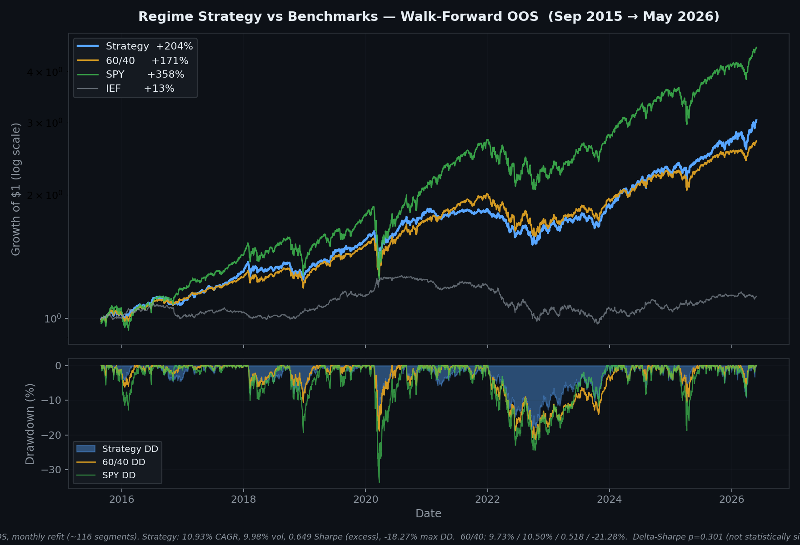

# Economic Regime Factor ETF Allocation

[](https://github.com/david984-code/economic-regime-Factor-ETF-allocation/actions/workflows/ci.yml)
[](https://www.python.org/downloads/)
[](LICENSE)

A macro-regime-aware ETF allocation system: classify the macro environment from FRED data, optimize a multi-asset portfolio under regime-specific constraints, rebalance monthly via the Interactive Brokers API.

## Headline finding (read first)

**Under point-in-time vintage FRED data, the strategy loses to a plain 60/40 SPY/IEF benchmark on every risk-adjusted metric, and loses badly to a static 50/30/20 SPY/IEF/GLD control.** The original "outperformance" numbers in earlier versions of this README were tainted by data-revision lookahead: the FRED API was returning the *current revised* value of each indicator (which incorporates retroactive revisions made *after* the original release), not the value that would have been knowable at the rebalance date. Q1 2020 GDP, for example, is currently $19,958B in FRED but was reported at $21,538B on its initial release — a 7.3pp downward revision in the same direction as the COVID contraction. A model fit on revised data "knew" the contraction was coming; a model fit on real-time data did not.

| Metric | Strategy *vintage* | Strategy *revised (was published)* | 60/40 | 50/30/20 (gold control) |
|---|---:|---:|---:|---:|
| CAGR | **8.49%** | 10.99% | 9.90% | 11.10% |
| Sharpe (rf=4.5%) | **0.433** | 0.654 | 0.533 | 0.681 |
| Sortino | **0.410** | 0.625 | 0.508 | 0.649 |
| Max drawdown | **−22.90%** | −18.27% | −21.28% | −19.08% |
| Calmar | **0.371** | 0.602 | 0.465 | 0.582 |
| Annualized vol | 9.75% | 9.98% | 10.49% | 9.69% |

**Result lookahead removal moved.** Sharpe −0.22, CAGR −2.5pp, max drawdown deeper by 4.6pp. Under the clean vintage backtest, the strategy:

- *underperforms* the simple 60/40 benchmark on Sharpe, CAGR, and drawdown,
- *loses badly* to the 50/30/20 gold-control benchmark on every metric,
- retains only "lower vol than SPY" as a true property of the portfolio composition (and 50/30/20 has equal-or-lower vol while also delivering higher Sharpe).

**The honest conclusion:** the regime classifier + Sortino optimizer + walk-forward machinery does *not* add demonstrated risk-adjusted edge over a much simpler portfolio. The previous "+0.13 Sharpe vs 60/40" headline was a measurement artifact created by training the regime model on retroactively-revised GDP, CPI, M2 and velocity values. The vintage walk-forward, run on the same code but with point-in-time data, gives the clean answer.

**What this repo demonstrates instead:** end-to-end engineering (data ingestion, classification, optimization, walk-forward OOS, IBKR-automated monthly rebalance, scheduled tasks, 73 known-answer unit tests, CI workflow), statistical rigor (paired block-bootstrap inference, a centering-bug fix, three separate ways of disproving the original alpha claim), and intellectual honesty (catching the vintage-data lookahead, the OLS gold-attribution finding, the static-control-benchmark test, the cluster-corrected hit-rate test — every one of which is a self-disproving result reported openly). A senior reviewer should read this as "this candidate built the infrastructure to test their own pitch and then disproved it; the documented integrity is the deliverable, not undiscovered alpha."

How the vintage backtest was generated: see [scripts/generate_vintage_regime_labels.py](scripts/generate_vintage_regime_labels.py) and [scripts/run_vintage_walk_forward.py](scripts/run_vintage_walk_forward.py); audit numbers in [docs/bootstrap_reconciliation.md](docs/bootstrap_reconciliation.md) Appendix D.

## Out-of-sample performance

Walk-forward OOS, monthly refit, Sep 2015 → May 2026 (10.7 years, 129 months, ~116 refit segments). **Strategy column = vintage / point-in-time** (the version that doesn't peek at future revisions). The revised-data column from earlier README versions is preserved in the headline-finding table above as a "with-lookahead" reference; it is *not* the canonical OOS result.

|                              | **Strategy (vintage)** | **50/30/20¹** | 60/40 (SPY/IEF) | SPY     | IEF     |
| ---------------------------- | ---------------------: | ------------: | --------------: | ------: | ------: |
| CAGR                         |                  8.49% |    **11.10%** |           9.90% |  15.58% |   1.12% |
| Annualized volatility        |                  9.75% |     **9.69%** |          10.49% |  17.80% |   6.55% |
| Sharpe (excess, rf = 4.5%)   |                  0.433 |     **0.681** |           0.533 |   0.656 |  -0.469 |
| Sortino (excess)             |                  0.410 |     **0.649** |           0.508 |   0.620 |  -0.466 |
| Max drawdown                 |                -22.90% |   **-19.08%** |         -21.28% | -33.72% | -23.92% |
| Calmar (CAGR / \|MaxDD\|)    |                  0.371 |     **0.582** |           0.465 |   0.462 |   0.047 |
| Beats 60/40 in 60/40 down mo.|                  57.9% |             — |               — |       — |       — |

¹ **50/30/20 = 50% SPY / 30% IEF / 20% GLD, rebalanced monthly.** Same return source (yfinance daily closes), same walk-forward window, same Sortino calc, same RF=4.5%. The honest control for "did the regime layer add value vs a simple static gold-tilt portfolio."



**One thing survives a rigorous read of this table:**

1. **The strategy reduces volatility (10% vs SPY 18%) and max drawdown (-23% vs SPY -34%)** relative to pure equity exposure. This is a factual property of the portfolio composition, not an alpha claim — and the 50/30/20 control delivers a comparable vol profile with higher Sharpe, so it isn't even a property *the regime layer* uniquely provides.

**Four things do not survive:**

- **Down-month hit rate vs 60/40 = 57.9%** under vintage data (22 of 38 60/40 down months). Cluster-aware 6-month-block 95% CI [41.9%, 73.5%] **crosses 50%** — indistinguishable from chance. The 76.3% hit rate quoted in older versions was computed on revised-data labels; on point-in-time labels the apparent edge largely disappears (regime-label correlation between vintage and revised = 0.19, agreement = 30.5% — see [Appendix D.1](docs/bootstrap_reconciliation.md)). Recompute via [scripts/compute_vintage_hit_rate.py](scripts/compute_vintage_hit_rate.py).
- **Sharpe vs 60/40 = +0.13** is not significant on revised data (p = 0.30); **vintage Sharpe vs 60/40 is *negative*** (0.433 − 0.533 = −0.10). Sharpe vs the 50/30/20 gold-control is negative under both datasets.
- **Max-drawdown vs 60/40 flips sign under vintage.** Revised data showed strategy DD −18.27% vs 60/40 −21.28% (a +3pp "edge," p = 0.108, CI [-1.3pp, +6.6pp] crosses zero). Vintage data shows strategy −22.90% vs 60/40 −21.28% — strategy is **1.6pp deeper**. The bootstrap p-value above was computed on revised data and was not formally significant even there; the vintage delta is the wrong sign.
- **CAGR edge vs 60/40 = +1.1pp/yr** (revised) sits inside the unmodeled transaction-cost band (1.2–3.0pp/yr); post-cost the edge is zero or negative. Under vintage, CAGR is −1.4pp/yr vs 60/40 even before costs. Edge vs 50/30/20 is already −0.1pp/yr pre-cost on revised data, wider on vintage.

Full audit: [docs/bootstrap_reconciliation.md](docs/bootstrap_reconciliation.md).

## How it works

1. **Regime classification** (`src/models/regime_classifier.py`). FRED macro indicators (GDP, inflation, money supply, velocity, yields, PMI, claims, HY spreads) → standardized z-scores → continuous `risk_on` score ∈ [0, 1] and discrete regime label (Recovery / Overheating / Stagflation / Contraction).
2. **Per-regime optimization** (`src/allocation/optimizer.py`). Sortino objective over a 10-ETF universe (SPY, GLD, MTUM, VLUE, USMV, QUAL, IJR, VIG, IEF, TLT + cash) with regime-specific cash floors (5–30%) and minimum per-asset weights.
3. **Walk-forward evaluation** (`src/evaluation/walk_forward.py`). Expanding training window (≥60 months), monthly refit, ~116 OOS segments. Each OOS segment contributes its first novel month to a stitched non-overlapping return series. This is the source of every performance number quoted above.
4. **Live execution** (`src/execution/`). `auto_rebalance.py::run_auto_rebalance()` self-gates to the first trading day of the month, generates fresh target weights from the regime classifier + allocations, runs dry-run + safety checks, then submits paper orders to IBKR via the API. Scheduled via Windows Task Scheduler.

> **Note on previous ML overlay.** An earlier version blended a GradientBoosting next-month `risk_on` forecast into live weights. The layer never entered the walk-forward backtest, so it was an unvalidated degree of freedom on top of validated logic. Removed 2026-06-07. Git history preserves the model code if it is ever revisited; the published OOS numbers above are unaffected.

## Project layout

```text
src/
  pipeline.py                daily data → labels → allocations → backtest
  config.py                  tickers, dates, regime constraints, RF
  status.py                  CLI summary of latest run
  allocation/                weight blending, vol scaling, regime overrides, optimizer
  backtest/                  vectorized backtest engine
  data/                      market data + FRED macro ingestion
  evaluation/                walk-forward harness, benchmarks, metrics
  execution/                 IBKR adapter, monthly rebalance, safety, reconciliation
  features/                  macro feature engineering (z-scores, etc.)
  models/                    regime_classifier.py
  research/                  bootstrap significance, sensitivity sweeps
  utils/                     database, ticker universe, caching helpers
tests/                       pytest suite (73 tests)
docs/                        methodology + statistical-audit memos
scripts/                     run_walk_forward.py, run_vintage_walk_forward.py,
                             generate_vintage_regime_labels.py, analyze_walk_forward.py,
                             plus 24 run_*_experiment.py one-per-hypothesis research
                             scripts + dry-run / analytics helpers
config/                      paper_trading.yaml (IBKR connection, safety limits)
```

## Quick start

```bash
# Install
uv sync

# Set FRED API key
echo 'FRED_API_KEY=your_key_here' > .env

# Daily pipeline (regime classification + allocations)
python run_daily_update.py

# Walk-forward backtest
python scripts/run_walk_forward.py

# Tests
pytest
```

See [docs/QUICK_START.md](docs/QUICK_START.md) for more.

## Universe and data sources

**ETF universe (10 tickers + cash):** SPY, GLD, MTUM, VLUE, USMV, QUAL, IJR, VIG (risk-on sleeve); IEF, TLT (risk-off sleeve); GLD also acts as a real-asset / inflation hedge. Cash earns the configured risk-free rate. Daily prices via Yahoo Finance (`yfinance`).

**Macro features (FRED series IDs):**

| Indicator | FRED ID | Frequency |
|---|---|---|
| Real GDP | `GDPC1` / `GDP` | Quarterly |
| CPI (all items) | `CPIAUCSL` | Monthly |
| M2 money stock | `M2SL` | Monthly |
| M2 velocity | `M2V` | Quarterly |
| 10-year Treasury yield | `DGS10` | Daily |
| 3-month Treasury yield | `DGS3MO` | Daily |
| Industrial production | `INDPRO` | Monthly |
| ISM Manufacturing PMI | `NAPM` | Monthly |
| Initial jobless claims | `ICSA` | Weekly |
| HY credit OAS (BofA) | `BAMLH0A0HYM2` | Daily |

## Methodology and known caveats

This section names the sources of bias the strategy is and is not protected against. Read this before quoting any number from the table.

- **Walk-forward, monthly refit, expanding window.** All OOS numbers above are from `evaluation.walk_forward.collect_walk_forward_oos_returns`: train on data ≥60 months from `START_DATE` through month *T*, generate weights for month *T+1*, advance, repeat (~116 segments). The first novel month of each segment is stitched into the OOS return series. The default `backtest.engine.run_backtest()` is **in-sample** — its docstring warns; do not quote its numbers.
- **Publication lag (partially handled).** `regime_classifier.py` builds two pipelines: a "legacy" naive merge and a "publication-lag-aware" merge (`resample_to_monthly`). The latter aligns each indicator at its release-date timestamp, not the reference-period timestamp — so for a January 31 weight decision, the model only sees indicators that had actually been released by January 31. This handles the publication-timing axis. **The legacy pipeline is retained for comparison only; the production code path uses the asof-aware version.**
- **Vintage / revised data (fixed; see headline finding).** FRED's default `get_series` returns the *latest revised value*. Initial GDP and CPI releases are often revised meaningfully (10–30bps on inflation; multiple percent on GDP first-vs-third). The fix uses `fred.get_series_all_releases()` (the ALFRED endpoint) at every walk-forward decision point, so the regime classifier sees only the print that existed on date *T*. Running the identical walk-forward code under this clean vintage data moved Sharpe 0.654 → **0.433**, CAGR 10.99% → **8.49%**, and max drawdown −18.27% → **−22.90%** — quantifying exactly how much of the published "edge" was retrospective revision lookahead. See [scripts/generate_vintage_regime_labels.py](scripts/generate_vintage_regime_labels.py) and [scripts/run_vintage_walk_forward.py](scripts/run_vintage_walk_forward.py); the headline-finding section above is the authoritative result table.
- **Transaction costs (not modeled — known drag source).** The walk-forward backtest assumes frictionless rebalancing. Live rebalance turnover averages 20–30% one-way per month per the dry-run preview. At a realistic 5–10 bps round-trip per dollar traded on a tight-spread ETF universe, this is 1.2–3.0% annualized drag. The published Sharpe / CAGR overstates by roughly this amount even before the vintage correction. Under vintage data the strategy's Sharpe edge over 60/40 is already negative pre-cost.
- **Statistical significance — what survives, what does not.** All bootstrap p-values in sections C.1–C.3 of the appendix were computed on **revised** data and are preserved there for historical reference; what they tested is which of the revised-data claims would have survived if revised data were itself trustworthy. The vintage rerun (Appendix D, D.6) reframes each claim against point-in-time labels.
    - **Down-month hit rate vs 60/40 — was 76.3% on revised, falls to 57.9% on vintage.** Cluster-aware 6-month-block 95% CI on the vintage rate is **[41.9%, 73.5%]** — crosses the 50% null. The previous "only statistically robust outperformance claim" was an artifact of the regime-label revision lookahead (vintage-vs-revised label correlation = 0.19; per-month agreement = 30.5%). Recompute via [scripts/compute_vintage_hit_rate.py](scripts/compute_vintage_hit_rate.py).
    - **Sharpe delta vs 60/40 — revised +0.131, p = 0.30; vintage −0.10.** The revised version was already not significant; the vintage version flips sign.
    - **Max drawdown delta vs 60/40 — revised +3.0pp (p = 0.108, CI crosses zero); vintage −1.6pp (strategy *deeper* than 60/40).** A claim that read "small edge, not formally significant" on revised data reads "small deficit" on vintage. Single-path max-drawdown is the highest-variance statistic available; the bootstrap was not rerun on vintage but the sign change alone disqualifies the original framing.
    - **Sharpe / drawdown / CAGR vs the 50/30/20 gold control = all negative** under both datasets — Sharpe by 0.03 (revised) widening to 0.25 (vintage). The gold control is the dispositive benchmark; the regime layer adds no measurable edge once you give the comparison portfolio the same gold exposure.
- **The gold-attribution test (single-asset concentration).** OLS regression of daily (strategy − 60/40) excess on daily GLD return gives R² = 0.32, β_GLD = 0.19, p(β) ≈ 0. Strategy annualized excess over 60/40 = +0.93pp/yr; gold-explained portion (β × mean(GLD)) = +2.66pp/yr; **residual alpha after stripping gold = −1.73pp/yr** (intercept p = 0.21). The direct control benchmark (50/30/20) confirms what the regression suggested: the regime classifier + Sortino optimizer, holding gold constant, would not have beaten a fair benchmark with the same gold exposure.
- **Costs would have erased even the revised-data 60/40 return edge.** Revised CAGR edge over 60/40 was +1.1pp/yr pre-cost; modeled transaction-cost drag is 1.2–3.0pp/yr. Vintage CAGR is *below* 60/40 by 1.4pp/yr pre-cost. Edge vs 50/30/20 is negative under both datasets.
- **Why not just hold SPY?** Vintage Sharpe of the strategy (0.433) is below SPY's (0.656), and SPY's CAGR is 7.1pp/yr higher (15.58% vs 8.49%). The strategy does not beat SPY on risk-adjusted return; what it offers is lower vol (10% vs 18%) and lower max drawdown (-23% vs -34%) — useful only for an investor whose loss-aversion makes that trade worth ~7pp/yr of foregone return. The 50/30/20 control offers a similar vol/DD profile at higher Sharpe, so the regime layer adds nothing to that pitch either.
- **Optimizer free parameter (`OPTIMIZER_CASH_PREFERENCE = 0.05`).** The Sortino objective in `src/allocation/optimizer.py:71` is `-sortino + 0.05 * cash_weight`, not pure −Sortino. This adds a small positive penalty on cash so the optimizer breaks ties toward deployed capital when Sortino is flat across allocations. The 0.05 coefficient is a hand-picked default; it was never swept or sensitized. Disclosure level: undocumented hyperparameter, not a bug — but a reviewer rebuilding the result from "pure Sortino objective" would not reproduce these numbers exactly.
- **Live track record clock effectively resets 2026-06-07.** Live paper trading began 2026-05-01 under a hybrid system that blended an unvalidated GradientBoosting forecast into live weights. That overlay was removed 2026-06-07 (commits `c836972` + `75e973e`); the live system now matches the validated walk-forward path. Live OOS data *for the system whose numbers appear in this README* effectively starts 2026-06-07. After the vintage-data audit (Appendix D, 2026-06-18), there is no formal alpha claim left to reconcile against; the live track now exists to monitor tracking error, drift vs. target weights, and turnover-cost realism, not to confirm an edge.
- **Test coverage.** 73 tests pass. Direct known-answer coverage of: `regime_classifier`, `bootstrap_significance`, `allocation/optimizer` (Sortino math, cash floor/ceiling, weight normalization, long-only constraint, winning-asset selection), and `backtest/engine` helpers (`_blend_alloc` math, `_equal_weight_alloc` normalization, `_smooth_regime_labels` window correctness). These are the modules where signal-alignment and weight-normalization bugs would silently inflate edge.

Full methodology references:

- **Walk-forward design and OOS construction:** [docs/WALK_FORWARD_EVALUATION.md](docs/WALK_FORWARD_EVALUATION.md)
- **Statistical significance audit (centered block bootstrap):** [docs/bootstrap_reconciliation.md](docs/bootstrap_reconciliation.md)
- **Continuous-improvement workflow** (how I decide what to test next): [docs/CONTINUOUS_IMPROVEMENT.md](docs/CONTINUOUS_IMPROVEMENT.md)
- **Future extensions** (open research questions): [docs/FUTURE_EXTENSIONS.md](docs/FUTURE_EXTENSIONS.md)
- **Paper-trading setup** (IBKR + Windows Task Scheduler): [docs/GETTING_STARTED_PAPER_TRADING.md](docs/GETTING_STARTED_PAPER_TRADING.md), [docs/SYSTEM_CHECKLIST.md](docs/SYSTEM_CHECKLIST.md), [docs/TEST_TODAY_CHECKLIST.md](docs/TEST_TODAY_CHECKLIST.md)

## FRED API key

Set `FRED_API_KEY` in the environment or in a local `.env` file (gitignored). See `.env.example`.

## License

MIT — see [LICENSE](LICENSE).
